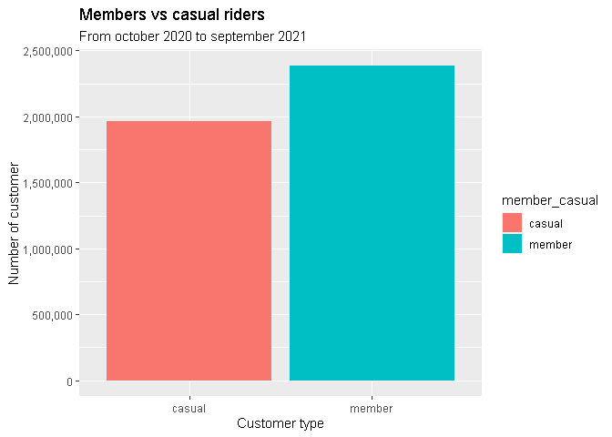
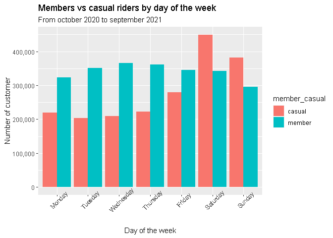
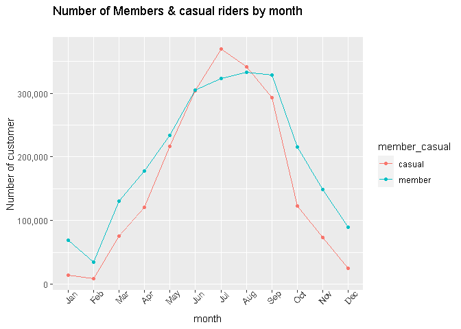
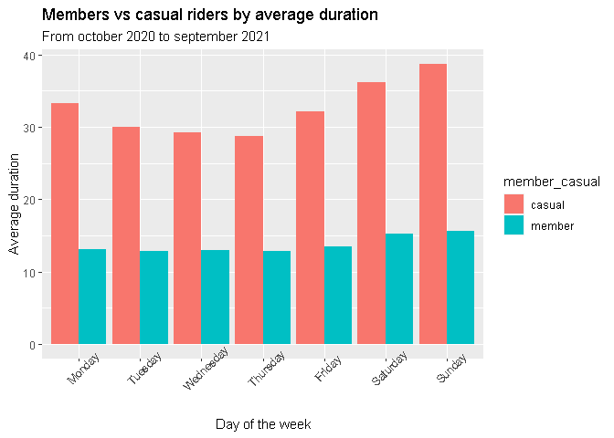

Cyclistic bike-share analysis - Case study
================


``` r
knitr::opts_chunk$set(fig.path='Figs/')
```

### Introduction

This case study is the capstone project of the [Google Data Analytics
Professional Certificate](https://www.coursera.org/professional-certificates/google-data-analytics?utm_source=google&utm_medium=institutions&utm_campaign=gwgsite&_ga=2.54262445.403704245.1637397436-146999043.1637397436). In this case study, we will perform data
analysis for a fictional bike-share company to help them attract more
riders.

### Scenario

You are a junior data analyst working in the marketing analyst team at
Cyclistic, a bike-share company in Chicago. The director of marketing
believes the company’s future success depends on maximizing the number
of annual memberships. Therefore, your team wants to understand how
casual riders and annual members use Cyclistic bikes differently. From
these insights, your team will design a new marketing strategy to
convert casual riders into annual members. But first, Cyclistic
executives must approve your recommendations, so they must be backed up
with compelling data insights and professional data visualizations.

### Objective

Our objective for this analysis is to draw insights from the available
data that demonstrates how annual members and casual riders use
Cyclistic bikes differently in the last 12 months. Additionally, we have
to provide a summary of our analysis with supporting visualizations and
three recommendations based on our analysis.

### Prepare for the analysis

In this phase, we are going to download our data and verify its
credibility and integrity . We are going to check for any licensing,
privacy and security issues, see how the data is organized as well if
there are any other problems with the data.

#### Downloading the data, and verifying its credibility and integrity

We will use Cyclistic’s historical trip data to analyze and identify
trends. The data is available
[here](https://divvy-tripdata.s3.amazonaws.com/index.html). The data has
been made available by Motivate International Inc. under this
[license](https://www.divvybikes.com/data-license-agreement). The data
does not contain any personal or identifiable information. This is
public data that we can use to explore how different customer types are
using Cyclistic bikes.

### Process

In this phase we are going to decide which tools we are going to use,
check the data for errors, transform the data so we can work with it
effectively and document the cleaning process.

#### Choosing the tools

After downloading our 12 data sets, We decided to use R for this
analysis. The reason behind our choice is the size of the data : 913MB.
The process of organizing and cleaning data would be very slow if we use
spreadsheets. With R we will be able to make the entire analysis process
and also make high-quality visualizations.

#### Installing packages

``` r
#install.packages("tidyverse")
#install.packages("lubridate")
#install.packages("ggplot2")
library(tidyverse) 
library(lubridate)  
library(ggplot2)
```

#### Loading datasets

``` r
trip_2020_10 <- read_csv("202010-divvy-tripdata.csv")
trip_2020_11 <- read_csv("202011-divvy-tripdata.csv")
trip_2020_12 <- read_csv("202012-divvy-tripdata.csv")
trip_2021_01 <- read_csv("202101-divvy-tripdata.csv")
trip_2021_02 <- read_csv("202102-divvy-tripdata.csv")
trip_2021_03 <- read_csv("202103-divvy-tripdata.csv")
trip_2021_04 <- read_csv("202104-divvy-tripdata.csv")
trip_2021_05 <- read_csv("202105-divvy-tripdata.csv")
trip_2021_06 <- read_csv("202106-divvy-tripdata.csv")
trip_2021_07 <- read_csv("202107-divvy-tripdata.csv")
trip_2021_08 <- read_csv("202108-divvy-tripdata.csv")
trip_2021_09 <- read_csv("202109-divvy-tripdata.csv")
```

#### Viewing specifications for each dataset

The number and names of columns have are consistent in each dataset.
Although we noticed some inconsistencies in the type of the columns
start_station_id, end_station_id for the months of October and November
2010, where they are set as numeric values instead of characters.

``` r
colnames(trip_2020_10)
```

    ##  [1] "ride_id"            "rideable_type"      "started_at"        
    ##  [4] "ended_at"           "start_station_name" "start_station_id"  
    ##  [7] "end_station_name"   "end_station_id"     "start_lat"         
    ## [10] "start_lng"          "end_lat"            "end_lng"           
    ## [13] "member_casual"

``` r
spec(trip_2020_10)
```

    ## cols(
    ##   ride_id = col_character(),
    ##   rideable_type = col_character(),
    ##   started_at = col_datetime(format = ""),
    ##   ended_at = col_datetime(format = ""),
    ##   start_station_name = col_character(),
    ##   start_station_id = col_double(),
    ##   end_station_name = col_character(),
    ##   end_station_id = col_double(),
    ##   start_lat = col_double(),
    ##   start_lng = col_double(),
    ##   end_lat = col_double(),
    ##   end_lng = col_double(),
    ##   member_casual = col_character()
    ## )

``` r
#dim(trip_2020_10)
#head(trip_2020_10)
#str(trip_2020_10)
#summary(trip_2020_10)
```

#### Removing columns that will not use in this analysis: lat, long

``` r
trip_2020_10 <- trip_2020_10 %>%  
  select(-start_lat, -start_lng, -end_lat, -end_lng)  

trip_2020_11 <- trip_2020_11  %>%  
  select(-start_lat, -start_lng, -end_lat, -end_lng) 

trip_2020_12 <- trip_2020_12  %>%  
  select(-start_lat, -start_lng, -end_lat, -end_lng)

trip_2021_01 <- trip_2021_01  %>%  
  select(-start_lat, -start_lng, -end_lat, -end_lng)

trip_2021_02 <- trip_2021_02  %>%  
  select(-start_lat, -start_lng, -end_lat, -end_lng)

trip_2021_03 <- trip_2021_03  %>%  
  select(-start_lat, -start_lng, -end_lat, -end_lng)

trip_2021_04 <- trip_2021_04  %>%  
  select(-start_lat, -start_lng, -end_lat, -end_lng)

trip_2021_05 <- trip_2021_05  %>%  
  select(-start_lat, -start_lng, -end_lat, -end_lng)

trip_2021_06 <- trip_2021_06  %>%  
  select(-start_lat, -start_lng, -end_lat, -end_lng)

trip_2021_07 <- trip_2021_07  %>%  
  select(-start_lat, -start_lng, -end_lat, -end_lng)

trip_2021_08 <- trip_2021_08  %>%  
  select(-start_lat, -start_lng, -end_lat, -end_lng)

trip_2021_09 <- trip_2021_09  %>%  
  select(-start_lat, -start_lng, -end_lat, -end_lng)
```

#### Converting start_station_id and end_station_id of October and November 2010 to character values so that they can stack correctly

``` r
trip_2020_10 <- trip_2020_10  %>% 
  mutate(trip_2020_10, start_station_id = as.character(start_station_id),
         end_station_id = as.character(end_station_id))
trip_2020_11 <- trip_2020_11  %>% 
  mutate(trip_2020_11, start_station_id = as.character(start_station_id),
         end_station_id = as.character(end_station_id))
```

#### Stack individual datasets into one

``` r
combined_trips <- bind_rows(trip_2020_10, trip_2020_11, trip_2020_12, trip_2021_01, trip_2021_02, 
                       trip_2021_03, trip_2021_04, trip_2021_05, trip_2021_06, trip_2021_07,trip_2021_08,
                       trip_2021_09)
```

#### Cheking specifications of the new dataset

``` r
#View(combined_trips)
colnames(combined_trips)
```

    ## [1] "ride_id"            "rideable_type"      "started_at"        
    ## [4] "ended_at"           "start_station_name" "start_station_id"  
    ## [7] "end_station_name"   "end_station_id"     "member_casual"

``` r
nrow(combined_trips)
```

    ## [1] 5136261

``` r
#dim(combined_trips)
#head(combined_trips)
#str(combined_trips)
summary(combined_trips)
```

    ##    ride_id          rideable_type        started_at                 
    ##  Length:5136261     Length:5136261     Min.   :2020-10-01 00:00:06  
    ##  Class :character   Class :character   1st Qu.:2021-04-11 18:50:57  
    ##  Mode  :character   Mode  :character   Median :2021-06-21 18:01:31  
    ##                                        Mean   :2021-05-25 22:30:57  
    ##                                        3rd Qu.:2021-08-11 21:13:51  
    ##                                        Max.   :2021-09-30 23:59:48  
    ##     ended_at                   start_station_name start_station_id  
    ##  Min.   :2020-10-01 00:05:09   Length:5136261     Length:5136261    
    ##  1st Qu.:2021-04-11 19:15:05   Class :character   Class :character  
    ##  Median :2021-06-21 18:20:59   Mode  :character   Mode  :character  
    ##  Mean   :2021-05-25 22:51:34                                        
    ##  3rd Qu.:2021-08-11 21:33:57                                        
    ##  Max.   :2021-10-01 22:55:35                                        
    ##  end_station_name   end_station_id     member_casual     
    ##  Length:5136261     Length:5136261     Length:5136261    
    ##  Class :character   Class :character   Class :character  
    ##  Mode  :character   Mode  :character   Mode  :character  
    ##                                                          
    ##                                                          
    ## 

``` r
table(combined_trips$member_casual)
```

    ## 
    ##  casual  member 
    ## 2358287 2777974

``` r
table(combined_trips$rideable_type)
```

    ## 
    ##  classic_bike   docked_bike electric_bike 
    ##       2750831        677980       1707450

#### Checking for errors, where started_hour is > than ended_hour

``` r
dim(filter(combined_trips,started_at > ended_at)) 
```

    ## [1] 3304    9

#### Checking how many ‘NA’ entries in the dataset

``` r
cbind(lapply(lapply(combined_trips, is.na),sum)) 
```

    ##                    [,1]  
    ## ride_id            0     
    ## rideable_type      0     
    ## started_at         0     
    ## ended_at           0     
    ## start_station_name 523467
    ## start_station_id   523781
    ## end_station_name   567268
    ## end_station_id     567501
    ## member_casual      0

#### Checking for duplicate entries

``` r
sum(duplicated(combined_trips$ride_id))
```

    ## [1] 209

#### Removing incomplete records ( fields having ‘NA’ values ), rides having started_at after ended_at , and duplicates

``` r
combined_trips_v2 <- combined_trips %>%
  drop_na(start_station_name, end_station_name) %>%
  filter(started_at <= ended_at) %>%
  filter(!duplicated(ride_id))

dim(combined_trips) # Original number of records
```

    ## [1] 5136261       9

``` r
dim(combined_trips_v2)
```

    ## [1] 4351282       9

#### Adding columns that list the date, month, day, day of week, hour and year for each ride

``` r
#putting my names in english for consistency
Sys.setlocale("LC_TIME", "English")
```

    ## [1] "English_United States.1252"

``` r
combined_trips_v2$date <- as.Date(combined_trips_v2$started_at) 
combined_trips_v2$month <- format(as.Date(combined_trips_v2$date), "%b")
combined_trips_v2$day <- format(as.Date(combined_trips_v2$date), "%d")
combined_trips_v2$year <- format(as.Date(combined_trips_v2$date), "%Y")
combined_trips_v2$day_of_week <- format(as.Date(combined_trips_v2$date), "%A")
combined_trips_v2$start_hour <- strftime(combined_trips_v2$started_at, "%H")
```

#### Adding a “ride_length” calculation (in minutes)

``` r
combined_trips_v2$ride_length <- round(difftime(combined_trips_v2$ended_at,combined_trips_v2$started_at, units="mins"),2)

combined_trips_v2 %>%
  select(ride_length,date,year,month,day,day_of_week, start_hour) %>%
  head(.,10)
```

    ## # A tibble: 10 x 7
    ##    ride_length date       year  month day   day_of_week start_hour
    ##    <drtn>      <date>     <chr> <chr> <chr> <chr>       <chr>     
    ##  1 17.48 mins  2020-10-31 2020  Oct   31    Saturday    20        
    ##  2 14.13 mins  2020-10-31 2020  Oct   31    Saturday    00        
    ##  3  8.35 mins  2020-10-31 2020  Oct   31    Saturday    00        
    ##  4  2.87 mins  2020-10-31 2020  Oct   31    Saturday    23        
    ##  5 16.22 mins  2020-10-31 2020  Oct   31    Saturday    20        
    ##  6  7.65 mins  2020-10-29 2020  Oct   29    Thursday    18        
    ##  7 14.83 mins  2020-10-29 2020  Oct   29    Thursday    10        
    ##  8 15.32 mins  2020-10-29 2020  Oct   29    Thursday    17        
    ##  9 11.55 mins  2020-10-29 2020  Oct   29    Thursday    17        
    ## 10  3.57 mins  2020-10-28 2020  Oct   28    Wednesday   22

#### Convert “ride_length” to numeric so we can run calculations

``` r
combined_trips_v2$ride_length <- as.numeric(as.character(combined_trips_v2$ride_length))
is.numeric(combined_trips_v2$ride_length)
```

    ## [1] TRUE

#### Ordering the days of week and months

``` r
combined_trips_v2$day_of_week <- ordered(combined_trips_v2$day_of_week, 
                                 levels=c("Monday", "Tuesday", "Wednesday", 
                                          "Thursday", "Friday", "Saturday",
                                          "Sunday"))

combined_trips_v2$month <- ordered(combined_trips_v2$month, 
                                         levels=c("Jan", "Feb", "Mar", 
                                                  "Apr", "May", "Jun",
                                                  "Jul", "Aug", "Sep", "Oct", "Nov", "Dec"))
```

### Analysis

In this phase, we are going to aggregate our data s, perform
calculations and identify trends, and relationships

#### Mean, Median, Minimum and Maximum of ride_length by customer type

``` r
combined_trips_v2 %>% 
  group_by(member_casual) %>%
  summarize(mean(ride_length),median(ride_length),min(ride_length),
            max(ride_length))
```

    ## # A tibble: 2 x 5
    ##   member_casual `mean(ride_length)` `median(ride_length)` `min(ride_length)`
    ##   <chr>                       <dbl>                 <dbl>              <dbl>
    ## 1 casual                       33.5                  17.2                  0
    ## 2 member                       13.7                  10.1                  0
    ## # ... with 1 more variable: max(ride_length) <dbl>

#### Comparing the numbers of members and casual riders

``` r
combined_trips_v2 %>% 
  group_by(member_casual) %>%
  summarise(numbe_riders = length(ride_id), "%" = (length(ride_id)/nrow(combined_trips_v2))*100)
```

    ## # A tibble: 2 x 3
    ##   member_casual numbe_riders   `%`
    ##   <chr>                <int> <dbl>
    ## 1 casual             1964095  45.1
    ## 2 member             2387187  54.9

#### Comparing the number of members and casual riders by day of the week

``` r
aggregate(combined_trips_v2$ride_id ~ combined_trips_v2$member_casual + combined_trips_v2$day_of_week, FUN = "length")
```

    ##    combined_trips_v2$member_casual combined_trips_v2$day_of_week
    ## 1                           casual                        Monday
    ## 2                           member                        Monday
    ## 3                           casual                       Tuesday
    ## 4                           member                       Tuesday
    ## 5                           casual                     Wednesday
    ## 6                           member                     Wednesday
    ## 7                           casual                      Thursday
    ## 8                           member                      Thursday
    ## 9                           casual                        Friday
    ## 10                          member                        Friday
    ## 11                          casual                      Saturday
    ## 12                          member                      Saturday
    ## 13                          casual                        Sunday
    ## 14                          member                        Sunday
    ##    combined_trips_v2$ride_id
    ## 1                     219117
    ## 2                     324072
    ## 3                     203633
    ## 4                     351370
    ## 5                     208618
    ## 6                     366082
    ## 7                     222621
    ## 8                     362084
    ## 9                     278790
    ## 10                    345891
    ## 11                    449444
    ## 12                    341995
    ## 13                    381872
    ## 14                    295693

##### Comparing the number of members and casual riders by month

``` r
aggregate(combined_trips_v2$ride_id ~ combined_trips_v2$member_casual + combined_trips_v2$month + combined_trips_v2$year , FUN = "length") 
```

    ##    combined_trips_v2$member_casual combined_trips_v2$month
    ## 1                           casual                     Oct
    ## 2                           member                     Oct
    ## 3                           casual                     Nov
    ## 4                           member                     Nov
    ## 5                           casual                     Dec
    ## 6                           member                     Dec
    ## 7                           casual                     Jan
    ## 8                           member                     Jan
    ## 9                           casual                     Feb
    ## 10                          member                     Feb
    ## 11                          casual                     Mar
    ## 12                          member                     Mar
    ## 13                          casual                     Apr
    ## 14                          member                     Apr
    ## 15                          casual                     May
    ## 16                          member                     May
    ## 17                          casual                     Jun
    ## 18                          member                     Jun
    ## 19                          casual                     Jul
    ## 20                          member                     Jul
    ## 21                          casual                     Aug
    ## 22                          member                     Aug
    ## 23                          casual                     Sep
    ## 24                          member                     Sep
    ##    combined_trips_v2$year combined_trips_v2$ride_id
    ## 1                    2020                    122499
    ## 2                    2020                    215184
    ## 3                    2020                     72920
    ## 4                    2020                    149162
    ## 5                    2020                     24492
    ## 6                    2020                     89049
    ## 7                    2021                     14690
    ## 8                    2021                     68819
    ## 9                    2021                      8613
    ## 10                   2021                     34383
    ## 11                   2021                     75641
    ## 12                   2021                    130048
    ## 13                   2021                    120420
    ## 14                   2021                    177783
    ## 15                   2021                    216829
    ## 16                   2021                    234164
    ## 17                   2021                    304189
    ## 18                   2021                    304585
    ## 19                   2021                    369407
    ## 20                   2021                    322902
    ## 21                   2021                    341469
    ## 22                   2021                    332916
    ## 23                   2021                    292926
    ## 24                   2021                    328192

#### Comparing the average duration of rides by day of the week

``` r
aggregate(combined_trips_v2$ride_length ~ combined_trips_v2$member_casual + combined_trips_v2$day_of_week, FUN = mean)
```

    ##    combined_trips_v2$member_casual combined_trips_v2$day_of_week
    ## 1                           casual                        Monday
    ## 2                           member                        Monday
    ## 3                           casual                       Tuesday
    ## 4                           member                       Tuesday
    ## 5                           casual                     Wednesday
    ## 6                           member                     Wednesday
    ## 7                           casual                      Thursday
    ## 8                           member                      Thursday
    ## 9                           casual                        Friday
    ## 10                          member                        Friday
    ## 11                          casual                      Saturday
    ## 12                          member                      Saturday
    ## 13                          casual                        Sunday
    ## 14                          member                        Sunday
    ##    combined_trips_v2$ride_length
    ## 1                       33.21130
    ## 2                       13.12892
    ## 3                       30.04202
    ## 4                       12.91610
    ## 5                       29.20594
    ## 6                       12.96531
    ## 7                       28.72455
    ## 8                       12.85455
    ## 9                       32.19098
    ## 10                      13.48128
    ## 11                      36.11516
    ## 12                      15.29210
    ## 13                      38.70667
    ## 14                      15.60173

### Share

In this phase, we are going to create effective data visualizations, and
present our findings

#### Visualizing the number of members and casual riders

``` r
ggplot(combined_trips_v2, mapping= aes(x= member_casual, fill= member_casual)) + 
  geom_bar(position = "dodge") +
  labs(title = "Members vs casual riders", subtitle="From october 2020 to september 2021", x="Customer type", y="Number of customer") +
  scale_y_continuous(labels=scales::comma)
```

<!-- -->

#### Visualizing the numbers of members and casual riders by day of the week

``` r
ggplot(combined_trips_v2,mapping=aes(x=day_of_week, fill=member_casual)) + 
  geom_bar(position = "dodge")  +
  labs(title="Members vs casual riders by day of the week ", subtitle="From october 2020 to september 2021", x="Day of the week", y="Number of customer") +
  scale_y_continuous(labels=scales::comma) +
  theme(axis.text.x=element_text(angle= 45))
```

<!-- -->

#### Visualizing the numbers of members and casual riders by month

``` r
combined_trips_v2 %>% 
  group_by(member_casual, month) %>%
  summarise(number_riders = n()) %>%
  arrange(member_casual, month) %>%
  ggplot(aes(x = month, y= number_riders, group= member_casual)) + 
  geom_line(aes(color=member_casual)) +
  geom_point(aes(color=member_casual)) +
  labs(title="Number of Members & casual riders by month ", subtitle="", X= "Month", y="Number of customer") +
  scale_y_continuous(labels=scales::comma) +
  theme(axis.text.x=element_text(angle= 45))
```

    ## `summarise()` has grouped output by 'member_casual'. You can override using the `.groups` argument.

<!-- -->

#### Visualizing the numbers of members and casual riders by average duration of ride and day of the week

``` r
combined_trips_v2 %>% 
  group_by(member_casual, day_of_week) %>%
  summarise(average_duration= mean(ride_length)) %>%
  ggplot(aes(x = day_of_week, y=average_duration,  fill= member_casual)) + 
  geom_bar(position = "dodge", stat= 'identity')  + 
  labs(title="Members vs casual riders by average duration ", subtitle="From october 2020 to september 2021", x= "Day of the week", y="Average duration") +
  theme(axis.text.x=element_text(angle= 45)) #stat= to fix error with y axis, it says ggplot that we want to define our y and not the default stat_count
```

    ## `summarise()` has grouped output by 'member_casual'. You can override using the `.groups` argument.

<!-- -->

### Act

#### Findings

-   The graphs shows that there are a higher number of **Member**
    riders, but **Casual** riders have a higher duration of ride.
-   **Members** have a higher number of rides on almost every day of
    week except on the weekends, where the number of **Casual** riders
    are higher.
-   **Saturday** is the day of the week with the most rides.
-   The number of riders start to **increase at 8am**, and reach the
    **higher number of rides in the evenings at 19pm**.
-   The number of riders start to increase in mars and reach the
    **higher number in July**.

#### Recommendations

Based on the findings we can make the following recommendations:

-   Run add campaigns at the beginning of spring and summer, where the
    number of riders starts to increase.
-   Consider a free month trial or a discount for the new annual members
-   Consider new options of subscription like monthly
